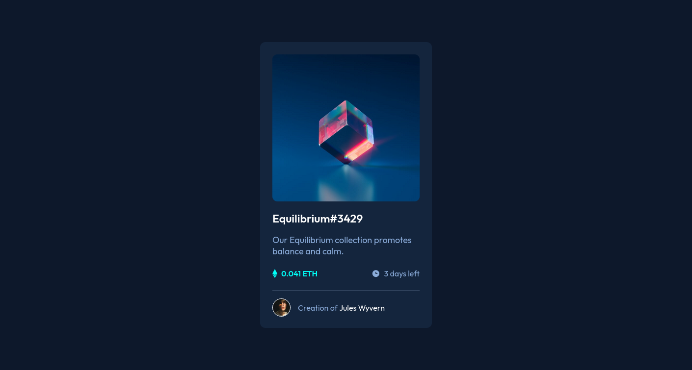

# NFT Preview Card Component

> A challenge from Frontend Mentor

## Table of contents

- [Overview](#overview)
- [My process](#my-process)
- [Author](#author)

## Overview

NFT Preview Card Component is a challenge from Frontend Mentor, where the proposal 
is to create a centered card that shows an NFT, the description of its collection,
price, available time, and attribution to the artist.

Want to see it live? Check it out on the Environment section, or click [here!]()

Or, do you want to check the challenge page? Click [here!](https://www.frontendmentor.io/challenges/nft-preview-card-component-SbdUL_w0U/hub/nft-preview-card-component--BH_KPuT5i)

## My process

This project was made with the [replit.com](https://replit.com) IDE, where I used basic HTML and CSS. 
Also, I used some basic Flexbox properties to properly center the NFT card and the logos.

Working on this project I was able to better develop my CSS skills, where I learned
key concepts of Flexbox, responsiveness and how to import external fonts into the code.

Although I think the code could be better optimized, I managed to get the expected result. 
With this project done, I want to continue developing my front-end skills, learn more
about Flexbox, and do bigger and more complex projects.

## Author

- Frontend Mentor - [@rafael-holanda](https://www.frontendmentor.io/profile/rafael-holanda)
- Twitter - [@rafinholanda](https://twitter.com/rafinholanda)